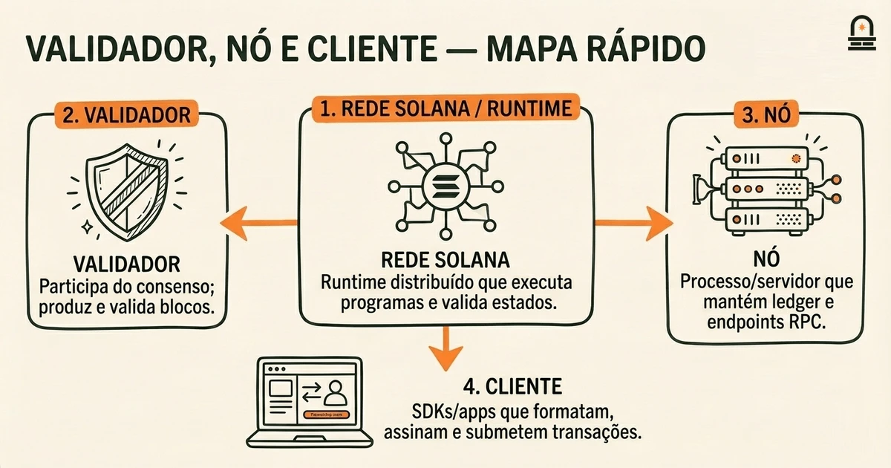
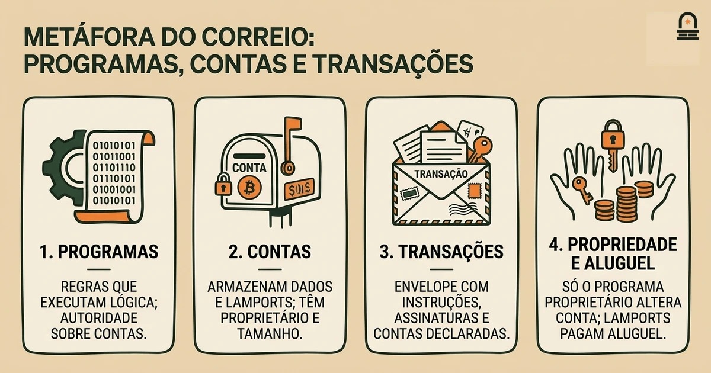
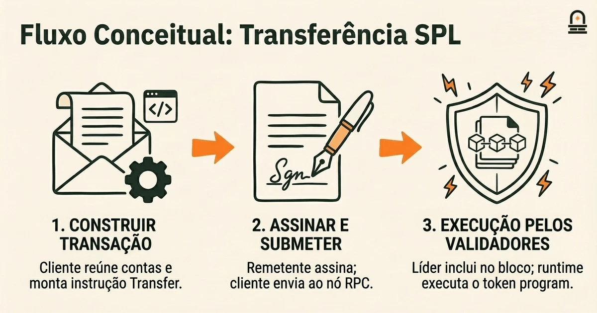

### Ouça também em áudio

[Ouvir este episódio no Spotify](https://open.spotify.com/episode/2oh8e3Plpim1WTuObsgWpr)

---

**Objetivo:** Explicar a terminologia Solana mais comum e interpretar esses termos em cenários curtos e concretos.

**Por que agora:** Esclarecer os termos agora ajuda os aprendizes a ler com confiança documentação e descrições de projetos posteriormente.

**Conceitos:** Definições de validadores, nós e clientes na terminologia Solana; Conceitos de programas, contas e transações em termos Solana; Unidades e taxas conforme descritas na terminologia Solana; Exploradores e referências de recursos comuns à Solana; Como ler glossários e documentação de protocolo relacionados à terminologia Solana

**Tempo de leitura:** 20 min

---

## Recapitulação & Introdução

Você já sabe que a Solana separa responsabilidades entre participantes da rede e software: validadores mantêm o consenso, programas implementam lógica e clientes submetem transações. Na lição anterior você deve se lembrar que um validador não é um único serviço monolítico, mas um agente que executa software em um nó, e que desenvolvedores interagem principalmente com programas e contas em vez de com validadores diretamente.

Agora avançamos desse mapa de alto nível para o vocabulário de trabalho que você encontrará ao ler docs, logs de RPC, exploradores de blocos e READMEs de projetos. Definições contextuais claras permitem que você interprete frases curtas como "a transação falhou porque a conta não é isenta de aluguel" ou "verifique os logs do programa por incompatibilidade de program-id". Ao colocar a terminologia em cenários curtos e concretos, você reduzirá suposições quando depois inspecionar transações ou ler referências do protocolo.

A partir do próximo parágrafo, apresentamos os termos concretos com os quais você praticará aqui: validadores, nós, clientes, programas, contas, transações, lamports e taxas, e exploradores e referências de documentação. Você verá como cada termo é usado tecnicamente, como se relacionam no ciclo de vida de uma transação e como a mesma palavra pode aparecer com significado ligeiramente diferente dependendo do contexto (por exemplo, *conta* como armazenamento versus uma conta como um par de chaves de carteira). Essa interpretação contextual é a habilidade central que vamos desenvolver agora para que você possa ler material técnico da Solana com confiança.

## Objetivos de Aprendizagem

Ao final desta lição você será capaz de:

- Explicar a diferença entre validadores, nós e clientes e descrever o papel prático que cada um desempenha durante uma transação.
- Descrever o que a Solana entende por programas, contas e transações e identificar quais partes são mutáveis versus somente leitura em uma operação típica.
- Interpretar unidades e taxas: converter lamports para a unidade SOL usada na documentação e explicar como taxas e aluguel interagem com contas.
- Localizar e ler dados básicos de transações em um explorador de blocos, identificando assinaturas, status, mensagens de log e IDs de programas implicados.
- Usar um checklist curto ao ler glossários de protocolo ou docs para que você possa desambiguar termos que têm múltiplos contextos de uso na Solana.

## Conceitos Centrais: Validadores, Nós e Clientes

Comece separando três papéis relacionados, mas distintos: validador, nó e cliente. Um validador é um agente que participa do consenso e da produção de blocos propondo, votando e executando o runtime. Na prática, quando a documentação diz "validador", muitas vezes refere-se à configuração do software e à identidade econômica que recebe recompensas e participa do consenso; a chave pública e o stake do validador determinam seu peso nos agendamentos de líder. Um nó refere-se ao processo ou instância em execução—sua máquina, sua porta RPC e seu estado de ledger local. Você encontrará "nó" ao ler sobre logs, versões do runtime ou ao solucionar problemas quando um endpoint RPC se comporta de forma diferente.

Clientes são os programas ou bibliotecas que conversam com os nós. Quando um README instrui você a "usar o client SDK para submeter uma transação", isso significa que você executa código que formata instruções, serializa uma transação, a assina e a envia para um nó RPC. Clientes não produzem blocos; eles apenas submetem operações e observam o estado da cadeia. Reconheça que um único operador pode executar múltiplos nós e clientes: um operador pode rodar um nó validador para consenso e um RPC separado para consultas públicas, enquanto desenvolvedores usam bibliotecas clientes para submeter transações a esse nó RPC.

Mecanicamente, validadores executam o runtime que invoca programas e atualiza contas. Nós expõem endpoints RPC como `/getBalance`, `/getTransaction` e outros métodos especificados na Solana JSON RPC API. Quando um nó RPC retorna resultados diferentes de outro nó, a diferença muitas vezes se deve ao histórico de ledger do nó ou à configuração do RPC (por exemplo, se ele poda certos dados ou indexa logs de programa). Ao ler orientações operacionais, preste atenção se um documento menciona "saúde do validador", "status de sincronização do nó" ou "endpoint RPC"—cada frase sinaliza uma superfície de troubleshooting diferente.

Implicação: quando um guia diz para "pedir a um validador para confirmar", normalmente significa consultar o estado produzido pelo consenso; quando diz para "chamar o RPC", refere-se à API do nó. Essa distinção importa ao interpretar mensagens de erro. Por exemplo, uma transação rejeitada por um nó RPC com um erro de preflight pode ainda ser aceita por um nó configurado de forma diferente se esse nó oferecer configurações de simulação de preflight distintas. Entender esses papéis fará com que você interprete melhor instruções operacionais e identifique se uma instrução se refere ao estado de consenso (validador) ou a uma interface de serviço (nó/RPC) à qual clientes se conectam.

## Modelo Mental: Programas, Contas e Transações (a Metáfora do Correio)

Modelo Mental: Use uma metáfora concreta para guardar detalhes na memória: pense na Solana como um serviço postal distribuído. Programas são as regras e máquinas do correio—equipamentos de triagem e procedimentos dos atendentes que definem como os itens são processados. Contas são as caixas de correio e envelopes que carregam dados e tokens; elas têm proprietários, tamanhos e saldos. Transações são os envelopes que você entrega ao atendente com instruções sobre quais máquinas executar e quais caixas acessar.

Essa metáfora ajuda a raciocinar sobre mutabilidade e autoridade. Na Solana, programas são proprietários de contas quando o campo `owner` da conta aponta para o ID do programa; somente o programa proprietário pode alterar os dados da conta. Isso é como uma caixa de correio especializada que apenas a chave de um departamento específico pode abrir. Contas também carregam saldos em lamports que pagam o aluguel; pense neles como os selos necessários para manter uma caixa de correio ativa. Ao inspecionar documentação que afirma "a conta deve ser isenta de aluguel", traduza isso para: a caixa precisa de selos suficientes para não ser recolhida e deletada.

Abaixo está uma tabela de mapeamento concisa que você pode consultar enquanto lê docs:

| Elemento da Metáfora | Termo Solana | Detalhe Prático Chave |
| --- | --- | --- |
| Máquina de triagem / atendente | Programa | Executa instruções; o program ID determina autoridade sobre contas pertencentes ao programa. |
| Caixa de correio / envelope | Conta | Armazena dados & lamports; tem proprietário, limiar de isenção de aluguel e limite de tamanho de dados. |
| Cliente entregando o envelope | Transação | Agrupa instruções, inclui assinaturas, paga taxas e declara quais contas são lidas ou graváveis. |

Por que isso importa na prática: quando você lê um doc da Solana que diz "forneça contas graváveis na transação" você deve imediatamente pensar em qual caixa de correio precisa ser aberta e modificada durante a execução. A transação deve declarar as contas graváveis antecipadamente; você não pode adicioná-las enquanto um programa está em execução. Isso equivale a especificar quais caixas o atendente tem permissão para abrir ao processar seu envelope. Se a conta não foi listada como gravável, o programa não pode modificar seu conteúdo e a operação falhará com um erro de acesso à conta. Mantenha esse modelo mental quando ler documentos de contratos, pois muitos erros comuns se devem a contas mal declaradas ou expectativas de propriedade equivocadas.

Finalmente, essa metáfora esclarece logs e erros retornados. Se uma transação falha com a mensagem "Program failed to complete", pense em um atolamento da máquina: o atendente parou de processar ao encontrar um formato de envelope inesperado ou falta de selo. Saber qual conta a máquina estava operando (a partir dos logs ou do trace no explorador) direciona você para a caixa e o conjunto de regras exatos a serem inspecionados a seguir.

## Exemplo Passo a Passo: Uma Transação de Transferência de Token (conceitual)

Percorra um cenário conciso e concreto: um usuário envia uma transferência de token SPL de uma carteira para outra. Este walkthrough foca em como a terminologia aparece na prática; é conceitual e evita comandos ao vivo intencionalmente.

Papéis e artefatos: o remetente e o destinatário têm cada um um par de chaves de carteira e uma conta de token SPL associada (uma `Account` que armazena o saldo de token para aquele mint). O token program é um programa implantado com um program ID conhecido; esse programa possui todas as contas SPL token. O cliente é um SDK no seu ambiente que constrói a transação. Um nó RPC aceita a transação e a encaminha para os validadores para processamento.

Passo 1 — Construir a transação: O cliente reúne as contas necessárias: a conta de token do remetente (gravável), a conta de token do destinatário (gravável), o token program ID (somente leitura) e o system program quando necessário. O cliente adiciona uma instrução Transfer que nomeia essas contas e codifica a quantidade. Quando você lê um doc que lista "accounts: [sender, receiver, token_program]", interprete isso como a transação dizendo ao runtime quais caixas serão acessadas.

Passo 2 — Assinar e submeter (conceitualmente): A transação exige a assinatura do remetente para autorizar a movimentação de tokens de sua conta. O cliente anexa assinaturas no cabeçalho da transação e envia a transação serializada para um nó RPC. O nó RPC realiza uma simulação de preflight para detectar falhas óbvias, informa uma estimativa de taxa em lamports e então encaminha a transação para a rede para consenso.

Passo 3 — Execução pelos validadores: Um validador escalonado como líder inclui a transação em um bloco. Durante a execução, o runtime invoca a lógica do token program com as contas fornecidas. O token program verifica a propriedade das contas (verifica se ambas as contas de token são propriedade do token program), confere saldos, subtrai lamports ou a quantidade de token da conta do remetente, adiciona-os ao destinatário e emite logs de programa. Se uma verificação necessária falhar—como saldo insuficiente de token ou proprietário incorreto da conta—o programa retorna um erro e a transação reverte.

Passo 4 — Resultado e visão no explorador: Após o processamento, exploradores indexam e exibem seus campos. Ao abrir a transação em um explorador, campos típicos que você lerá incluem: assinaturas (a assinatura da transação), status (sucesso ou erro), taxa cobrada (em lamports), lista de contas tocadas com saldos pré e pós, mensagens de log do programa e o slot/confirmações. Quando um guia pede para você "inspecionar os logs do programa pela assinatura da transação", use o campo de assinatura para encontrar o trace exato da execução. Logs de programa frequentemente contêm mensagens legíveis pelo desenvolvedor que são valiosas para diagnosticar por que uma instrução falhou.

Implicação: na documentação, quando instruções listam "pré-condições" como "a conta do destinatário deve estar inicializada" eles estão dizendo quais caixas devem já existir e estar isentas de aluguel antes do atendente processar o envelope. Reconhecer cada etapa e onde termos específicos aparecem permitirá que você traduza notas curtas de protocolo em verificações concretas quando depois inspecionar transações reais ou ler READMEs de contratos.

## Conclusão & Principais Lições

Lembre-se de três princípios práticos. Primeiro, desambigue palavras baseadas em papéis: "validador" aponta para agentes de consenso e responsabilidades de stake/leader, "nó" para um processo em execução e superfície RPC, e "cliente" para o programa ou biblioteca que compõe e submete transações. Essa distinção ajuda você a interpretar instruções operacionais e logs corretamente.

Segundo, trate programas, contas e transações como uma pequena ontologia que você pode raciocinar com a metáfora do correio. Programas são as regras e máquinas, contas são as caixas que armazenam estado e lamports, e transações são os envelopes que declaram quais caixas o atendente pode abrir. Esse modelo mental é uma ferramenta diagnóstica compacta: quando você vê erros de acesso, verifique a propriedade e se a conta foi listada como gravável na transação.

Terceiro, ao ler saídas de transações em exploradores ou respostas RPC, foque nos campos específicos que importam: assinaturas, status, taxa em lamports, saldos pré/pós das contas e mensagens de log do programa. Esses pontos de dados concretos são o que autores de documentação referenciam ao descrever falhas ou condições de sucesso. Com esses princípios você será capaz de ler a documentação do protocolo Solana com mais fluência e mapear a terminologia para os conceitos centrais da arquitetura que estudou anteriormente.

Essas lições preparam você para categorizar projetos e ler documentação do ecossistema com mais precisão. A próxima lição mapeia categorias de projetos dentro da Solana e espera que você identifique quais vocabulários indicam sobre as responsabilidades e escolhas arquiteturais de um projeto.

## Recapitulação Rápida

- Validadores = atores de consenso; nós = processos em execução e endpoints RPC; clientes = SDKs ou programas que submetem transações.
- Programas executam lógica; contas armazenam estado e lamports; transações declaram quais contas são lidas ou escritas.
- Lamports são a menor unidade nativa; taxas e aluguel aparecem nas saídas de transações e nas diferenças de saldo das contas.
- Use exploradores para encontrar assinaturas, status, taxas, saldos pré/pós das contas e logs de programa ao diagnosticar comportamento.

## Próximos Passos

Prossiga para a próxima lição, "Mapeando Categorias de Projetos dentro do Ecossistema Solana", onde você aplicará a terminologia desta lição para classificar projetos por seu papel arquitetural. Ao seguir essa lição, use o checklist dos objetivos de aprendizagem: identifique quais componentes são programas, quais são contas, se um projeto executa validadores ou depende de provedores RPC externos, e como taxas ou aluguel podem afetar a experiência do usuário. Esse exercício de mapeamento depende da sua habilidade em ler exemplos de README e traces de explorador com o vocabulário que praticou aqui.

---

## Glossário

### Validador

Um agente que executa o software de consenso que propõe e vota em blocos; seu stake e sua identidade determinam os agendamentos de líderes e a participação no consenso.

### Nó (Nó RPC)

Uma instância em execução do software da Solana que expõe métodos RPC e mantém um ledger local; usado por clientes para consultar estado ou submeter transações.

### Cliente

Uma biblioteca ou programa que constrói, assina e submete transações para um nó RPC; clientes não executam a lógica dos programas por conta própria.

### Programa

Bytecode implantado que define a lógica on-chain; programas são invocados por transações e só podem modificar contas das quais são proprietários ou que estão autorizados a modificar.

### Conta

Uma unidade de armazenamento on-chain que contém dados e lamports; contas têm um programa proprietário, um saldo usado para aluguel e limites declarados de tamanho de dados.

### Lamport

A menor unidade nativa na Solana usada para medir saldos, taxas e aluguel; a documentação frequentemente reporta taxas em lamports.

### Assinatura da Transação

Uma string codificada em base58 produzida ao assinar uma transação; usada para localizar a transação em exploradores de blocos e para verificar a autoridade do remetente.

### Explorador

Um serviço web que indexa blocos e transações e exibe assinaturas, status, taxas, saldos pré/pós das contas e logs de programa para inspeção.

---

## Referências & Leitura Complementar

- [Documentação Solana: Conceitos Fundamentais](https://solana.com/docs) — *Solana Foundation* (Documentação Principal)
- [Referência da API JSON RPC da Solana](https://solana.com/docs/rpc) — *Solana Labs* (Referência do Desenvolvedor)
- [Programa SPL Token](https://www.solana-program.com/docs/token) — *Solana Program Library* (Padrões de Token)
- [Solana Explorer](https://explorer.solana.com/) — *Solana Explorer* (Exploradores e Ferramentas)
- [Contas e Estado na Solana](https://solana.com/docs/core/accounts) — *Solana Documentation* (Runtime e Contas)
