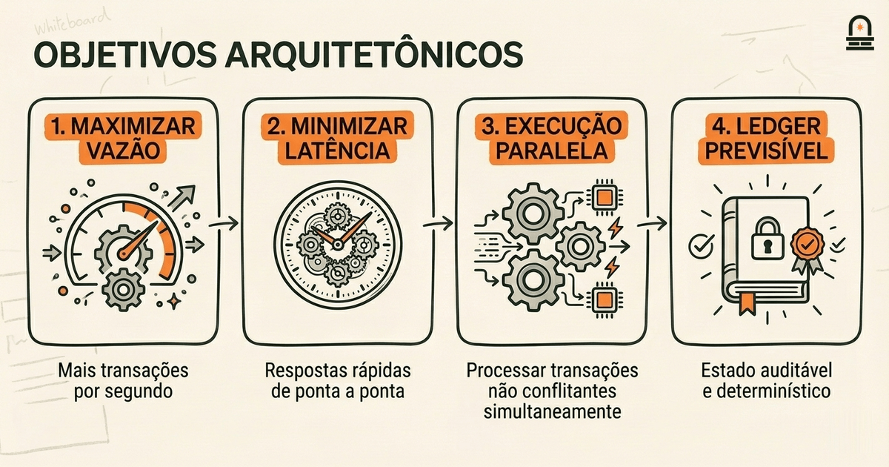
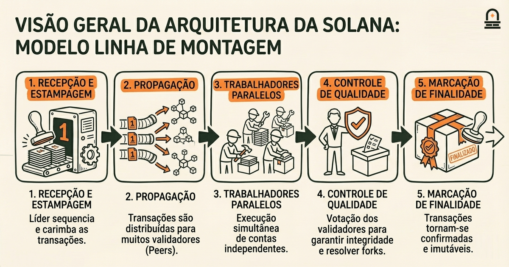
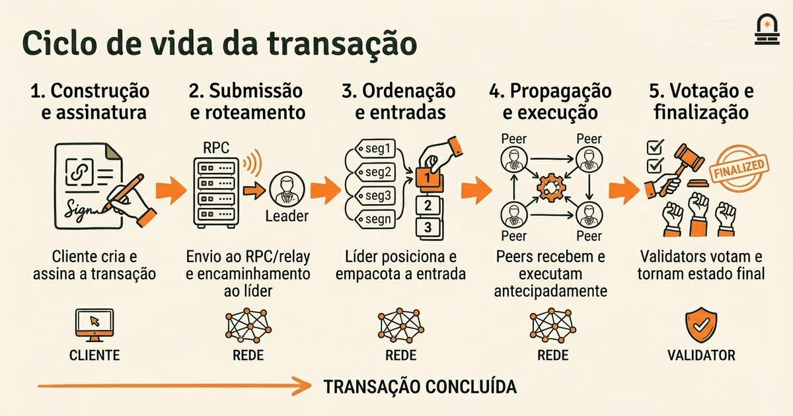

### Ouça também em áudio

[Ouvir este episódio no Spotify](https://open.spotify.com/episode/0nX5jiLDvepkBEHHGcHj12)

---

**Objetivo:** Descrever a estrutura e os objetivos de alto nível da arquitetura da Solana e identificar seus componentes primários.

**Por que agora:** Comece com uma visão em nível de sistema para que os aprendizes possam contextualizar detalhes técnicos apresentados depois.

**Conceitos:** objetivos da arquitetura da Solana e justificativa do design; topologia de rede e papéis dos nós; estrutura do ledger e organização do estado; ciclo de vida da transação em alto nível; interação entre componentes; compromissos de design na arquitetura

**Tempo de leitura:** 25 min

---

## Recapitulação & Introdução

Os trade-offs das fases iniciais de desenvolvimento da Solana priorizaram vazão e confirmação de baixa latência, e você viu na lição anterior como essas escolhas estratégicas — por exemplo priorizar alta vazão de transações sobre certos trade-offs de descentralização — moldaram o comportamento posterior da rede. Você deve lembrar uma ideia concreta daquela lição: trade-offs de design se manifestam como restrições de engenharia que reaparecem quando a rede escala, como a forma pela qual ordenação de blocos, incentivos aos validators e escolhas de sharding de estado criam tensões operacionais recorrentes.

Agora avançamos desses trade-offs históricos para um mapa em nível de sistema para que você possa contextualizar detalhes de runtime apresentados depois. Ao montar uma imagem de alto nível da arquitetura da Solana, você ganha um arcabouço mental que torna mais fáceis de entender tópicos posteriores sobre validators, componentes de runtime e mecanismos de concorrência. No início desta lição apresentamos os objetivos primários da arquitetura e os principais componentes que os implementam: o ledger e sua ordenação de entradas, a topologia de rede e os papéis dos nós, o runtime que executa transações em paralelo e o ciclo de vida amplo que uma transação segue desde o cliente até o estado finalizado.

Comece tratando a arquitetura como uma pilha de engenharia: objetivos e restrições no topo, mecanismos no meio e consequências operacionais na base. Você já conhece primitivos básicos de blockchain e fundamentos de sistemas distribuídos; use esse conhecimento para relacionar conceitos familiares (consenso, replicação de máquina de estado, mempools) com as abordagens específicas da Solana. Ao longo da lição distinguimos ideias gerais de blockchain de exemplos específicos do protocolo para que você possa reutilizar os modelos mentais mesmo se estudar outra cadeia no futuro.

## Objetivos de Aprendizagem

Ao final desta lição você será capaz de:

- Descrever os objetivos primários que motivaram a arquitetura da Solana e explicar a justificativa que liga esses objetivos a mecanismos específicos.
- Identificar e nomear os principais componentes e papéis dos nós na topologia de rede e descrever como eles interagem em alto nível.
- Explicar a estrutura do ledger e a organização do estado usados para registrar entradas e o estado de contas.
- Rastrear o ciclo de vida de uma transação em alto nível, desde a submissão pelo cliente até a finalização, observando onde ocorrem ordenação, propagação e execução.
- Reconhecer os principais trade-offs de design inerentes à arquitetura e articular implicações práticas para o comportamento do sistema e para o desenvolvimento.

Cada objetivo mapeia para um conceito concreto que você praticará reconhecer em lições posteriores sobre componentes de runtime e papéis de validators.

## Objetivos arquitetônicos da Solana e justificativa do design

A arquitetura da Solana é projetada em torno de um conjunto compacto de objetivos: maximizar a vazão de transações, minimizar a latência de ponta a ponta, possibilitar execução paralela de transações quando possível e preservar um ledger previsível e auditável. Esses objetivos se traduzem em ênfases arquitetônicas específicas: ordenação rápida e determinística de entradas; propagação agressiva de mensagens entre peers; e um modelo de runtime que tenta executar transações disjuntas concorrentemente em vez de serialmente. Você deve tratar cada objetivo como uma restrição que orienta escolhas em outras camadas da pilha.

Os mecanismos seguem os objetivos. Para ordenação e timestamping, a arquitetura introduz um primitivo de ordenação derivado do tempo para reduzir o custo do consenso sobre a ordem exata das mensagens recebidas. Para propagação, o design favorece um broadcast amplo e de baixa latência através de um grande conjunto de peers para que os nós possam ver novas entradas rapidamente. Para execução, o runtime espera independência ao nível de contas para que transações não conflitantes possam ser executadas em paralelo, o que aumenta a vazão sem exigir desempenho extremo single-thread. Quando você vir um mecanismo como pipeline agressivo ou execução paralela, relacione-o ao objetivo que ele serve: ordenação, propagação ou eficiência de execução.

Por que isso importa na prática: esses objetivos arquitetônicos determinam os trade-offs que você encontrará ao construir ou operar na rede. Por exemplo, maximizar a vazão ao permitir execução paralela reduz a latência por transação sob alta carga, mas impõe mais responsabilidade a programas e clientes para evitar conflitos indesejados entre contas. De forma similar, mecanismos rápidos de ordenação podem acelerar confirmações, mas tornam algumas formas de atomicidade entre shards ou zonas mais difíceis de garantir. Ao projetar aplicações ou raciocinar sobre desempenho, pergunte qual objetivo arquitetônico um comportamento suporta e o que ele implicitamente sacrifica.

Mantenha clara a distinção entre padrões gerais de blockchain e escolhas específicas da Solana. Muitas cadeias equilibram vazão e descentralização, mas mecanismos específicos do protocolo implementam esse equilíbrio de formas diferentes: algumas usam sharding, outras alongam intervalos de bloco, e a Solana favorece ordenação baseada em tempo mais paralelismo agressivo. Trate as escolhas da Solana como uma resposta à mesma questão que outras cadeias enfrentaram; esse enquadramento ajuda a comparar comportamentos sem confundir detalhes de implementação com conceitos genéricos.

Operacionalmente, esses objetivos influenciam papéis dos nós e a topologia: a rede espera que líderes produzam entradas ordenadas rapidamente, validators executem agressivamente e votem com frequência, e nós RPC respondam a leituras e gravações de clientes com snapshots de baixa latência. Você verá esses papéis mais de perto na próxima lição, mas por ora lembre-se da cadeia de design: objetivos -> mecanismos -> consequências operacionais. Essa cadeia é a maneira mais simples de prever como um novo recurso ou padrão de carga afetará o sistema.

## Modelo mental: o livro-razão de alto desempenho como linha de montagem

O Modelo Mental: Use a metáfora da linha de montagem para raciocinar sobre a arquitetura da Solana. Imagine um piso de fábrica onde insumos brutos (transações enviadas por clientes) entram em uma extremidade e produtos acabados (estado do ledger finalizado) emergem na outra. A linha tem estações distintas: recepção e estampagem (ordenação/carimbos de tempo), transportadoras de distribuição (propagação), trabalhadores paralelos (execução), controle de qualidade e junção (resolução de forks e votação), e embalagem (marcadores de finalidade). Mapear o protocolo nessa metáfora ajuda a prever gargalos e onde a concorrência pode ocorrer com segurança.

Recepção e estampagem: imagine uma máquina de estampagem rápida que atribui um número serial ordenado a cada insumo. Em termos específicos da Solana, esse papel é desempenhado por um mecanismo de ordenação derivado do tempo que permite que um líder produza entradas ordenadas em alta velocidade. A implicação prática é que a ordenação fica desacoplada do trabalho pesado de consenso: o líder pode sequenciar entradas rapidamente, reduzindo tempos de espera para o restante da linha. Você deve notar que a precisão da estampagem importa; se os carimbos divergirem ou líderes se comportarem mal, estações a jusante detectam e respondem via votação e mecanismos de resolução de forks.

Transportadoras de distribuição: uma vez carimbados, os itens são distribuídos pela fábrica através de várias esteiras. A camada de propagação de rede desempenha o mesmo papel: encaminha rapidamente entradas para muitos peers para que os trabalhadores possam começar o processamento. Quanto mais rápida e ampla for a distribuição, mais trabalhadores podem iniciar processamento paralelo com entradas consistentes, o que reduz a latência ponta a ponta. Na prática, distribuição ampla aumenta a demanda de largura de banda da rede e requer packetização eficiente e retransmissão para evitar se tornar o novo gargalo.

Trabalhadores paralelos: a metáfora da linha de montagem brilha aqui porque tarefas independentes podem ser processadas simultaneamente. No protocolo, as estações de trabalho correspondem a unidades de execução paralela que podem processar transações que tocam conjuntos disjuntos de contas. É aqui que o design de programas e contas importa: você aumenta a vazão se estruturar suas transações para evitar acessos conflitantes às mesmas contas. Trate a concorrência como uma propriedade cooperativa: ganhos de vazão dependem tanto da capacidade do runtime quanto do perfil de conflitos da carga de trabalho.

Controle de qualidade e junção: itens processados em paralelo devem ser reconciliados em uma única saída coerente. Essa reconciliação inclui verificar resultados, lidar com dependências e resolver forks. Em termos de blockchain, validators validam resultados de execução, trocam votos e escolhem a cadeia canônica de acordo com regras de escolha de fork. A embalagem (marcadores de finalidade) segue uma vez que o consenso atinge confiança suficiente. Se uma linha de fábrica não tivesse uma estação de junção eficaz, o trabalho paralelo poderia produzir produtos inconsistentes — o mesmo risco existe para execução paralela de transações sem uma lógica robusta de escolha de fork e votação.

Use esse modelo mental ao analisar desempenho ou depurar comportamentos: pergunte qual estação está saturada, se os itens estão sendo carimbados na ordem correta, se as esteiras (links de rede) estão perdendo ou atrasando itens e se os trabalhadores estão bloqueados por recursos compartilhados. A visão de linha de montagem facilita raciocinar sobre onde otimizações serão efetivas e onde trade-offs de design surgem, e enquadra componentes específicos da Solana como estações especializadas em um sistema familiar.

| Estágio da Linha | Papel Funcional | Exemplo Específico da Solana |
| --- | --- | --- |
| Recepção e Estampagem | Atribuir sequência/timestamps ordenados | Geração de entradas pelo líder com carimbos de tempo estilo PoH (específico do protocolo) |
| Transportadoras de Distribuição | Broadcast rápido de itens ordenados | Propagação peer-to-peer e retransmissão de pacotes |
| Trabalhadores Paralelos | Executar tarefas independentes concorrentemente | Execução paralela do runtime sobre contas disjuntas |
| Controle de Qualidade e Junção | Validar, votar e resolver forks | Votação de validators e lógica de escolha de fork |
| Embalagem | Marcar saídas finalizadas | Marcadores de finalidade e estado confirmado do ledger |

## Ciclo de vida da transação: do cliente ao estado finalizado

Visão do Processo: Rastreie uma transação típica em nível de sistema para ver onde ocorrem ordenação, propagação, execução e finalidade. O ciclo de vida se divide em estágios discretos: construção e assinatura, submissão e roteamento, ordenação e criação de entradas, propagação e execução antecipada, votação e escolha de fork, e finalização. Para cada estágio, observe se a atividade é do lado do cliente, em nível de rede ou em nível de runtime/validator.

Construção e assinatura (lado do cliente): você monta uma transação que inclui instruções, referências de contas e assinaturas. A assinatura prova autorização, mas não determina por si só a ordem de execução. Do ponto de vista de sistema, assinar é uma barreira local: garante que apenas mudanças autorizadas se propaguem. Como esta lição é conceitual, enfatizamos que a assinatura prova intenção enquanto a ordenação estabelece a sequência.

Submissão e roteamento (camada de borda/RPC): uma vez assinada, você submete a transação a um endpoint RPC ou a um relay. Em uma arquitetura de alta vazão, a camada de roteamento aceita transações e as encaminha para um nó da rede que as incluirá em um fluxo ordenado. Onde você submete importa: nós com menor latência ao líder atual ou ao conjunto de validators podem reduzir o tempo antes de a transação aparecer no log ordenado. Na prática, clientes frequentemente usam endpoints RPC próximos para minimizar a latência de submissão.

Ordenação e criação de entradas (papel de líder/ordenador): um nó de ordenação atribui à transação uma posição na sequência do ledger e a empacota em uma entrada. Na metáfora da linha de montagem, esta é a estação de estampagem. O sistema pode usar ordenação baseada em tempo ou um fluxo de entradas conduzido por líder para reduzir o overhead de consenso durante o sequenciamento inicial. A entrada ordenada torna-se a unidade fundamental que os demais nós processarão. Como a ordenação é autoritativa, transações conflitantes submetidas concorrentemente serão resolvidas por suas posições atribuídas.

Propagação e execução antecipada (rede e runtime): entradas ordenadas são propagadas pela rede para que validators possam buscá-las e começar a executar instruções. Um design de alta vazão incentiva execução antecipada: validators iniciam o trabalho assim que recebem as entradas, mesmo antes da finalidade global. Motores de execução paralela tentam rodar transações não conflitantes concorrentemente, aumentando a vazão. O trade-off é que execução antecipada exige gerenciamento cuidadoso do estado e mecanismos para detectar e lidar com conflitos descobertos posteriormente no pipeline.

Votação e escolha de fork (camada de consenso): validators trocam votos sobre o progresso do ledger e usam uma regra de escolha de fork para concordar sobre a cadeia canônica. Os votos ajudam a podar forks concorrentes e fornecem o sinal de segurança que outros nós usam para aceitar ou rejeitar ramos. A cadência e a rapidez da votação afetam a velocidade com que a rede alcança uma visão comum da história; votação mais rápida reduz a janela em que ramos conflitantes coexistem.

Finalização (estabilidade visível à aplicação): após peso de votos suficiente e confirmação, as transações são consideradas finalizadas e incorporadas em snapshots de estado imutáveis. Mecanismos de finalidade variam entre protocolos; em termos específicos da Solana, validators marcam checkpoints e o ledger reflete uma sequência durável. Para aplicações, a finalização é o ponto em que o estado pode ser tratado como estável para lógica de negócio e coordenação off-chain.

Por que esse fluxo importa na prática: ao projetar clientes ou programas, o estágio em que você espera confirmação determina como lidar com lógica de retry, idempotência e observação de estado. Por exemplo, se você assumir finalidade imediatamente após a submissão, pode enviar transações duplicadas em conflito; em vez disso, projete considerando a latência observada entre submissão e finalização e implemente idempotência ou detecção de conflito adequadamente. Entender o ciclo de vida também ajuda a escolher os pontos de integração corretos para monitoramento, depuração e tuning de desempenho.

## Conclusão & Principais Lições

Três princípios práticos devem guiar sua forma de pensar sobre a arquitetura da Solana. Primeiro, alinhe mecanismo ao objetivo: toda escolha arquitetônica que você observou existe para servir um objetivo de engenharia específico, como baixa latência, alta vazão ou execução paralela. Quando encontrar um comportamento do protocolo, pergunte qual objetivo ele implementa e qual restrição impõe em outras áreas.

Segundo, trate ordenação, propagação e execução como estágios separáveis. A arquitetura separa intencionalmente o sequenciamento rápido do consenso pesado e da execução. Esse desacoplamento é a razão pela qual o sistema pode alcançar alta vazão, mas também cria pontos onde inconsistências transitórias e conflitos devem ser tratados por votação e regras de escolha de fork. Manter os estágios distintos esclarece onde olhar ao diagnosticar problemas de desempenho ou correção.

Terceiro, a estrutura da carga de trabalho importa. Execução paralela traz ganhos apenas quando transações tocam estados disjuntos. Para desenvolvimento prático, estruture contas e movimentos para reduzir contenção e tornar o paralelismo do runtime efetivo. Esses princípios preparam você para entender responsabilidades de validators e detalhes internos do runtime na próxima lição: Core Runtime Components and Validator Roles, onde desmontamos os componentes que você viu em alto nível e examinamos como implementam os objetivos e estágios aqui cobertos.

## Recapitulação Rápida

- A arquitetura é orientada por objetivos: vazão, latência, paralelismo e ordenação auditável guiam escolhas de design.
- Use o modelo mental da linha de montagem: ordenação (estampagem) → propagação (transportadoras) → execução paralela (trabalhadores) → votação/junção → finalização (embalagem).
- Estágios do ciclo de vida da transação a lembrar: construção e assinatura, submissão e roteamento, ordenação e criação de entrada, propagação e execução, votação e escolha de fork, e finalização.
- Implicação prática: projete transações e contas para minimizar conflitos para que a execução paralela ofereça ganhos reais de vazão.

## Próximos Passos

Prossiga para a próxima lição, "Core Runtime Components and Validator Roles", onde desmontamos os componentes concretos que você conheceu em alto nível: o papel de líder/slot para ordenação, responsabilidades de execução dos validators e os módulos de runtime que viabilizam a execução paralela. Antes de avançar, revise o ciclo de vida da transação e o mapeamento da linha de montagem para que você possa reconhecer o propósito operacional de cada componente quando inspecionarmos logs e parâmetros de configuração em detalhe.

Ao abrir a próxima lição, esteja pronto para mapear nomes e processos específicos do runtime para os estágios desta lição. Esse preparo permitirá traduzir conceitos abstratos em ações práticas ao configurar nós ou projetar programas que tenham bom desempenho sob carga.

---

## Glossário

### Prova de História (PoH)

Um auxílio de ordenação específico do protocolo que produz uma sequência verificável de carimbos de tempo ou declarações para reduzir o custo da ordenação global.

### Líder / Slot

Uma janela de tempo e papel de nó responsável por produzir entradas ordenadas do ledger durante seu intervalo atribuído.

### Modelo de Conta

O layout de dados onde programas operam em slots de conta explícitos; padrões de acesso às contas determinam dependências de execução e paralelismo.

### Execução Paralela

Uma otimização de runtime que executa transações concorrentemente quando as contas acessadas não conflitam, melhorando a vazão.

### Entrada

Uma unidade compacta do ledger que carrega transações ordenadas e metadados usados pelos validators para executar e validar transições de estado.

### Escolha de Fork (Fork-Choice)

A regra ou mecanismo que os validators usam para selecionar uma cadeia canônica quando múltiplos ramos concorrentes existem.

### Finalização

O ponto em que os efeitos de uma transação são considerados estáveis e seguros para serem utilizados por aplicações e sistemas off-chain.

---

## Referências & Leitura Complementar

- [Solana: Um Protocolo para uma Nova Era de Escalabilidade em Blockchain (Whitepaper)](https://solana.com/solana-whitepaper.pdf) — *Solana Labs* (Design de Protocolo)
- [Visão geral da arquitetura Solana](https://docs.anza.xyz/clusters) — *Documentação Solana* (Visão Geral da Arquitetura)
- [O Runtime da Solana no Validador (Notas Técnicas)](https://docs.anza.xyz/validator/runtime) — *Agave / Anza Docs* (Runtime e Execução)
- [Padrões de design para propagação de blocos de alto desempenho](https://medium.com/solana-labs) — *Blog de Engenharia da Solana* (Rede e Propagação)
